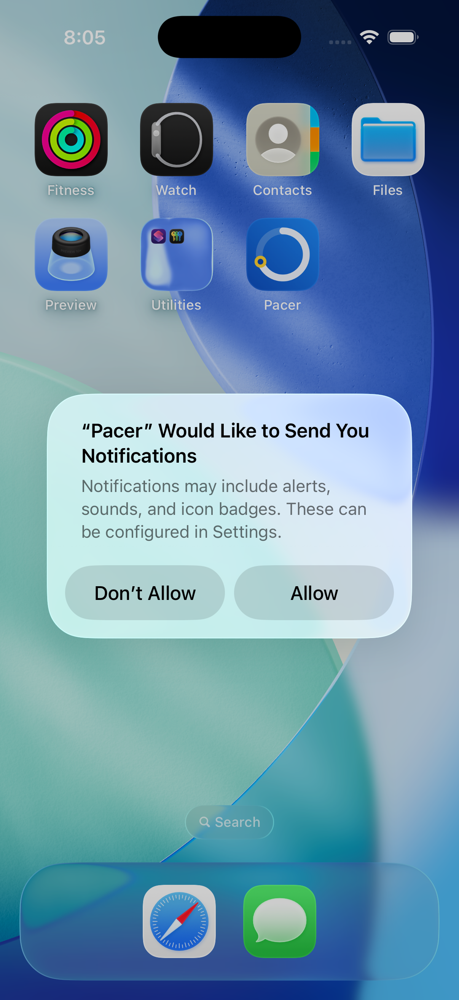
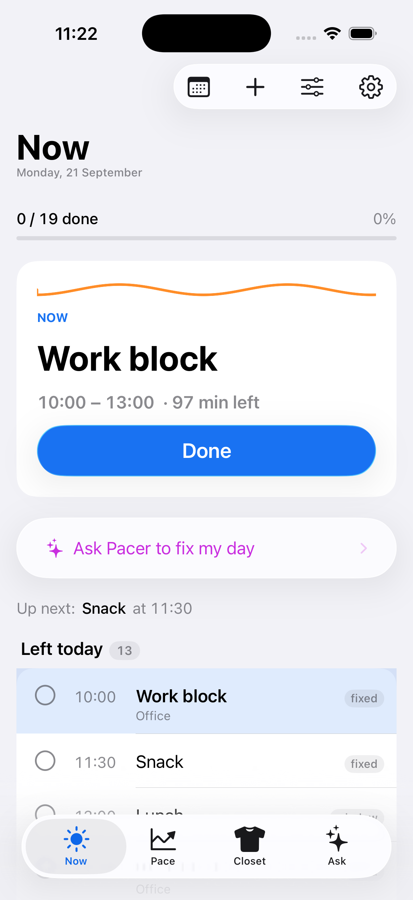
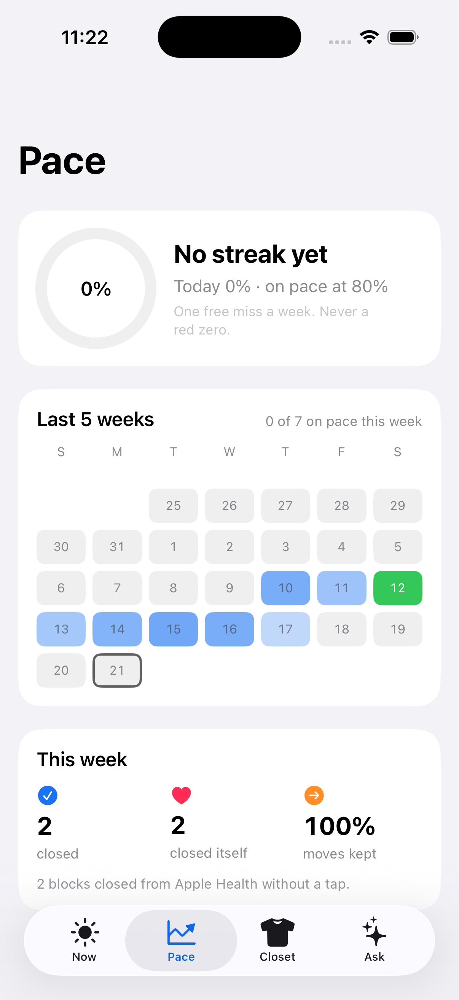
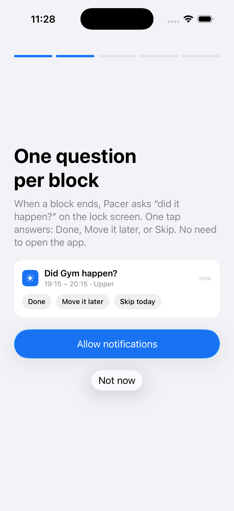
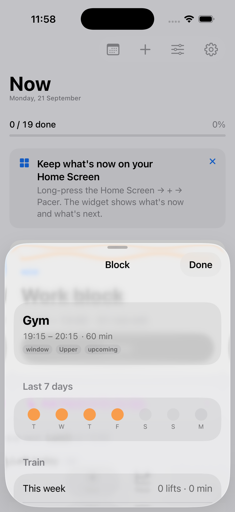
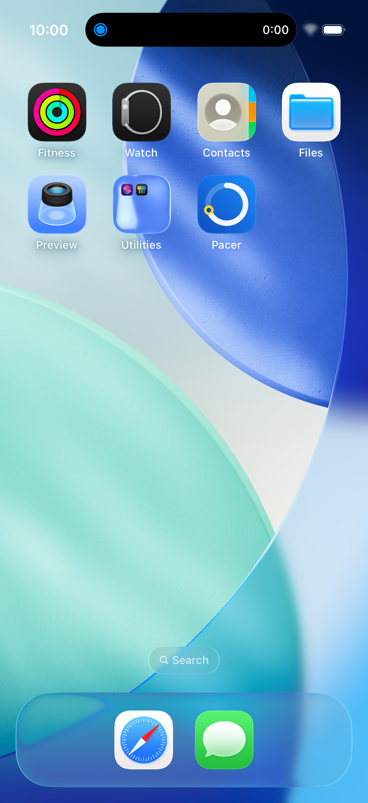
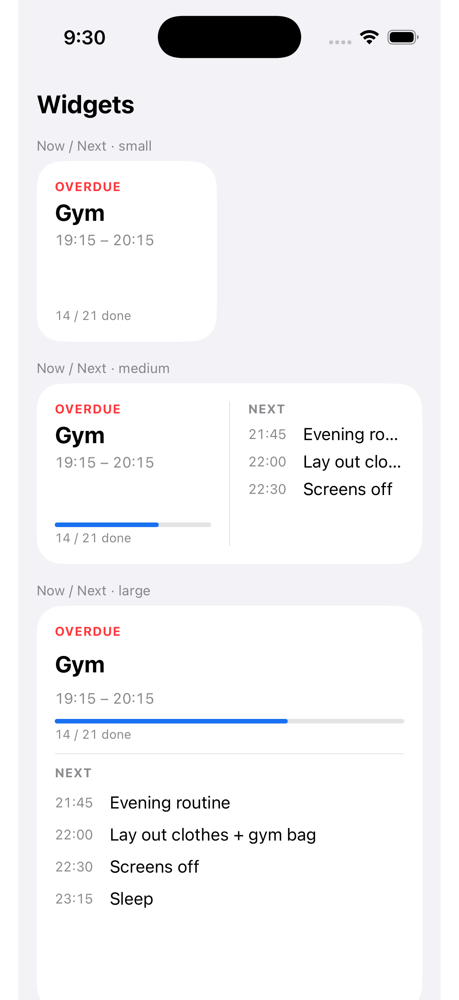
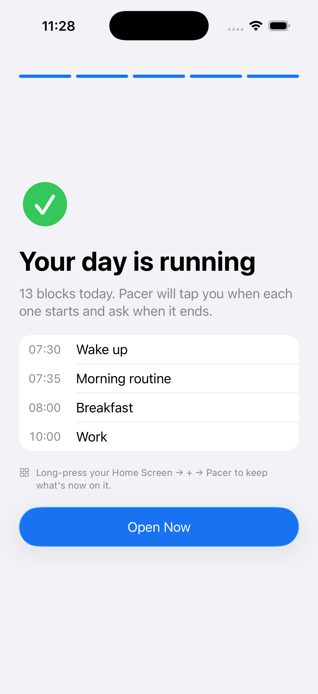
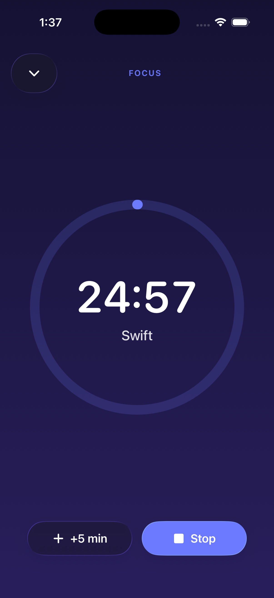

  

<h1 align="center">Pacer</h1>

<b>Runs your day so you don't have to.</b> 
It tells you what's now, asks whether it happened, and moves what didn't — travel time included, no guilt.

  
  
  
  
  

Pacer is an iOS app for people whose routine collapses by 2 pm — ADHD and "ADHD-ish" adults who have tried every planner. Planners ask you to open them and plan. Pacer works at the moment the plan breaks: a notification on the lock screen asks **"did it happen?"**, one tap answers, and the day repairs itself.

## The loop

1. **Now** — one card: what's now, minutes left, one big button. A pace line stays green while the day is on pace and turns amber when something slipped.
2. **Did it happen?** — when a block ends, a notification with *Done · Move it later · Skip today*. No need to open the app.
3. **Move it later** — a replanner finds the first gap that still fits, pushes what's behind it, respects travel time between your places and your calendar's meetings. One tap undoes it.
4. **Closes itself** — a run or gym session on your watch (via Apple Health) marks the block done without a tap. A study block closes after 20 minutes of focus.
5. **Pace** — days on pace accumulate into a streak with one free miss a week, a five-week grid, and what closed itself. Rewards are certain, never a slot machine.

## Screens

<table>
  <tr>
    <td align="center"> Now</td>
    <td align="center"> Pace</td>
    <td align="center"> Onboarding: one question per block</td>
    <td align="center"> A gym block, with Train inside</td>
  </tr>
  <tr>
    <td align="center"> Live Activity in the Dynamic Island</td>
    <td align="center"> Home and Lock Screen widgets</td>
    <td align="center"> Onboarding ends on a running day</td>
    <td align="center"> Focus timer</td>
  </tr>
</table>

## What's inside

- **Notifications that act**: repeating block starts, end-of-block check-ins with actions, leave-by reminders from Apple Maps ETAs, "ends in 5 min" nudges for long blocks, a morning brief, a custom chime, per-block quiet switch, and a 64-request budget managed soonest-first.
- **Replanner**: pure, tested; first fitting gap after now, cascading pushes, shrink when nothing fits, travel-aware obstacles, calendar events as busy time, undo.
- **Ask**: Pacer's assistant, a sheet from anywhere. Speak or type ("gym tomorrow at 7 at Smart Fit"); it acts through 54 typed tools against the same undoable write path as the UI. Streams its answers. Own Anthropic key or a subscription.
- **Quick add**: "gym 7pm 45m" becomes a block; no pickers unless you want them.
- **Integrations that remove questions**: Apple Health (workouts, weight, steps, sleep, resting HR, background delivery), MapKit (place search, ETAs by departure time), EventKit (read-only), WeatherKit, ActivityKit (two Live Activities), WidgetKit (three kinds, seven families), App Intents (seven Siri/Shortcuts actions), on-device Speech.
- **Optional sections** for people who want them: Train, Food, Focus, Money, Closet — toggles, not tabs by default.
- **Onboarding without typing**: goal chips become plan templates, profile chips become the assistant's context, the last screen is today already running.

## Privacy, as promises

1. Your data lives on your phone. Export it any time; delete the app and it's gone.
2. Ask sends only what a question needs, and nothing is kept.
3. No account unless you pay (Sign in with Apple, no email).
4. We count, we don't read: a random id and a few integers a day, one switch to turn off.

Full text: [`docs/privacy.md`](docs/privacy.md). The only network code is in `Sources/Coach/` and the 320-line proxy in [`server/`](server/).

## Built with

Swift 6 with strict concurrency (warnings as errors) · SwiftUI · iOS 26 Liquid Glass · Observation · Swift Charts · XcodeGen · no third-party dependencies in the app. Backend: Node on Railway — Apple identity-token verification (JWKS), HS256 sessions, per-user daily limits, streaming passthrough, anonymous cohort analytics on a volume.

Architecture: [`docs/ARCHITECTURE.md`](docs/ARCHITECTURE.md). Build, test and simulator checks: [`docs/DEVELOPING.md`](docs/DEVELOPING.md).

## Numbers (measured 2026-09-21)

12,524 lines of app Swift · 131 XCTest methods in 23 files · 5 server tests · 72 commits · 51 merged PRs · 23 TestFlight builds · six days from empty repo to build 23.

## Product work

- [`docs/PRODUCT.md`](docs/PRODUCT.md) — who it's for, the three-surface shape, fail-fast gates, a YC-lens scorecard.
- [`docs/USERS.md`](docs/USERS.md) — ten needs ranked from community research, each mapped to a gap.
- [`docs/APP-MAP.md`](docs/APP-MAP.md) — every surface, entry point and gap.
- [`docs/STORIES.md`](docs/STORIES.md) — user stories with acceptance criteria; issues [#48–#55](../../issues).
- [`docs/RESUME.md`](docs/RESUME.md) — the one-page summary.

## Status

On TestFlight (build 23). Next gate: 30 external testers within four weeks; D7 ≥ 25 %, D30 ≥ 20 %, DAU/MAU ≥ 20 %. Open work: overrun learning (#54), trial-end copy (#55), CI, Live Activity push updates.

## License

Source-available, all rights reserved: read and evaluate freely; using, copying or shipping it needs written permission. See [`LICENSE`](LICENSE).

## Author

Alan Cervantes — product, engineering, release. Built with [Claude Code](https://claude.com/claude-code) under his direction: every scope and architecture decision, device review and App Store step is his; the code was written with the agent. The product was called Autopiloto during development, which is why the bundle id and Xcode targets still say so.
